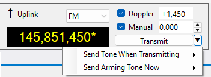

# Frequency Control

Frequency Control is the panel on the toolbar that allows you to read and control the frequencies
of the SDR receiver, external receiver and external transmitter:

## Downlink

The left hand part of the panel represents the receiver settings that apply to both SDR and external radio.

### Label

When the receiver is tuned to a downlink transmitter of some satellite, the label "Downlink" appears;
when it is tuned to a terrestrial station, the label "Terrestrial" is displayed. To tune to a downlink, select
some satellite in the
[Satellite Selector](satellite_selector.md)
panel, or select a different transmitter from the drop-down list, or click on the satellite name in any
panel. To tune to a terrestrial signal, click on it on the
[Waterfall Display](waterfall_display.md)
or on the
[Frequency Scale](frequency_scale.md),
or click on the downlink frequency display and enter the frequency in the **Tune to Frequency** window:

### Mode

Select the mode manually for every satellite transmitter that you are using.
Your selection is remembered and restored when the transmitter is selected again.

The **Mode** selected in the drop-down box applies to the SDR receiver, if it is enabled, and to the external receiver,
if RX CAT is enabled. To enable or disable the SDR or RX CAT, click on the corresponding label
on the status bar.

### Frequency Display

The frequency display shows either the nominal frequency of the downlink, or the frequency with all
corrections applied. Right-click on the display to switch between the two frequencies.

The mouse tooltip of the frequency display shows both frequencies and some other details.

When RX CAT is enabled and working properly, the frequency is shown in a bright color, otherwise
the display is dimmed. The color depends on the band: yellow/olive for VHF, cyan/teal for UHF,
white/gray for all other bands.

### Doppler

The **Doppler** box shows the current Doppler offset of the downlink signal. This value is not editable,
but Doppler correction may be enabled or disabled using the checkbox. See the
[Doppler Tracking](doppler_tracking.md) section for a detailed discussion of Doppler offset calculation
and tracking.

### Manual

The manual correction of the downlink frequency. The frequencies of the satellite downlink signals
usually differ from the nominal values in the database, for different reasons, by a few hundred Hertz
and up to a couple of kilohertz. This difference is pretty stable, so it is enough to enter the
correction once to have the receiver accurately tuned. SkyRoof remembers the manual correction
for each satellite.

The value of the  manual correction may be entered in the **Manual** box by clicking on the up/down
buttons, or by spinning the mouse wheel over the box, or by typing the value directly. However, it is
more convenient to adjust the correction visually, using the mouse on the
[Frequency Scale](frequency_scale.md).

The checkbox allows you to disable the manual correction if necessary.

### RIT

The RIT function is useful when listening to a conversation of two stations that are not
exactly on the same frequency, or when your CQ is answered off the frequency.

The RIT offset may be entered in the RIT box, but it is more convenient to control it on the
[Frequency Scale](frequency_scale.md).

Use the checkbox, or the commands on the **Frequency Scale**, to toggle RIT.

## Uplink

The Uplink part of the panel is similar to the Downlink part described above. It is enabled
only if the selected satellite transmitter has an uplink. The bright color of the frequency display
means that TX CAT is enabled and working properly. The **Transmit** button switches
the external radio between the RX and TX modes.

The **Manual Correction** setting of the uplink allows you to align your transmit and receive frequencies.
See the [Frequency Scale](frequency_scale.md) section for details.

## CTCSS Tone

The FM repeater satellites relay your signal only if a sub-audible CTCSS (PL) tone is present on the
uplink. The small button with a triangle, to the right of the **Transmit** button, opens the menu with
two tone commands:

The button is shown only if the uplink mode is FM and the radio can switch the CTCSS encoder over CAT.

### Send Tone When Transmitting

The tone that the radio sends during every transmission. Check **Enabled** to turn the encoder on and
off, and select the tone below the separator, for example 67.0 Hz for SO-50 and 141.3 Hz for PO-101.
The menu lists the 38 tones that all supported radios can send, which includes every tone used by the
FM satellites.

The tone and the on/off state are saved separately for each satellite transmitter, so switching to
another satellite applies the tone of that satellite, and turning the tone off does not lose the tone
that you selected.

If the radio has no CAT command for the tone frequency, for example the IC-706MKIIG, the tone entries
are disabled, and only **Enabled** is available. Select the tone frequency on the radio in that case.

### Send Arming Tone Now

SO-50 has a 10-minute on-board timer that must be armed before the satellite passes traffic. Select
74.4 in this menu to send a 2-second carrier with the 74.4 Hz arming tone. Sending it again within
the 10-minute window restarts the timer. When the burst ends, SkyRoof restores the tone and the
on/off state of the **Send Tone When Transmitting** command.

The command is disabled if the radio cannot select the tone or cannot be keyed over CAT. Key the
radio manually for about 2 seconds with the arming tone selected in that case.

> [!Note]
> On Icom radios, the **Auto Repeater** function turns CTCSS off when the frequency changes, and the
Doppler correction changes the frequency continuously. SkyCAT turns Auto Repeater off automatically
on the radios whose CI-V supports it. On the IC-910 and IC-706MKIIG, and when the radio is controlled
via rigctld, turn Auto Repeater off in the menu of the radio.

## Dial Knob

The dial knob of the transceiver can be used to tune the frequency when CAT control is enabled
and the **Ignore Dial Knob** option is set to **false**.

When both RX CAT and TX CAT are enabled, the dial knob controls the receiver frequency.

> [!Note]
> When the radio is in the SAT mode, the NOR/REV switch should be in the NOR position for correct
tuning with the dial knob.
