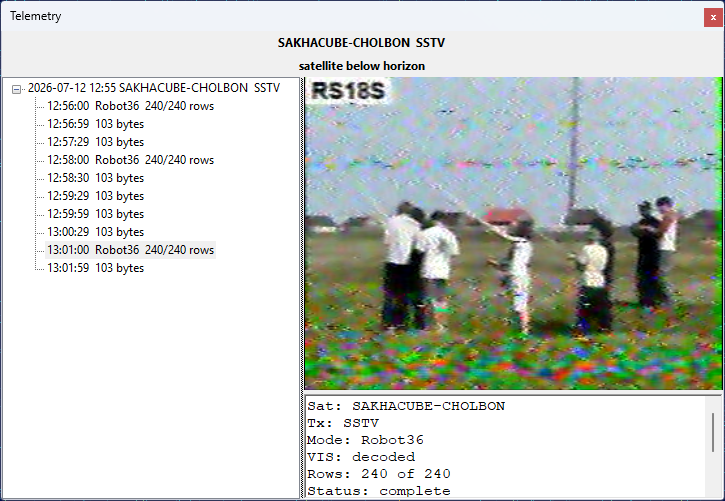

# Receive SSTV Images

Some satellites transmit **SSTV** (Slow-Scan Television) images over an FM downlink. SkyRoof
decodes these images with its built-in decoder, right inside the program — there is no need for an
external SSTV program, a Virtual Audio Cable, or an output stream. The decoded image is built up
line by line in the [Telemetry](telemetry_panel.md) panel as the satellite passes overhead.

## Supported Modes

The decoder supports the YCrCb mode family used by satellites:

- **Robot 36** and **Robot 72**;
- **PD 50**, **PD 90**, **PD 120**, **PD 160**, **PD 180**, **PD 240**, and **PD 290**.

The mode is detected automatically from the **VIS** header and the sync cadence of the received
signal, so you do not have to select it by hand. The RGB Martin and Scottie modes, which are rarely
used by satellites, are currently not supported.

## Decoding an Image

1. Open the [Telemetry](telemetry_panel.md) panel from the **View / Telemetry** menu.

2. Select the satellite in the [Satellite Selector](satellite_selector.md) on the toolbar. If it is
   not in the current group, add it using the [Satellites and Groups](satellites_and_groups_window.md)
   dialog.

3. Select the satellite's **SSTV transmitter**. You can select it in the
   [Satellite Transmitters](satellite_transmitters_panel.md) panel, or by clicking on its label on the
   [frequency scale](frequency_scale.md). The decoder follows the transmitter selection, so make sure
   the SSTV transmitter is the one highlighted in the
   [Satellite Transmitters](satellite_transmitters_panel.md) panel.

4. Make sure the SDR is running and tuned to the satellite. The decoder uses the same
   Doppler-corrected passband as the receiver, so the satellite's signal must be visible on the
   [waterfall](waterfall_display.md) at the tuned frequency.

When the satellite is above the horizon and its signal starts to appear, the decoder detects the SSTV
transmission and begins building the image. Each image appears as a node in the tree, under the pass
node, and updates in place as new scan lines arrive. Select an image node to watch it build up in the
detail pane on the right, together with a **META** section that shows the satellite, transmitter,
mode, whether the VIS header was decoded, the number of rows received, and the decoding status.

There is nothing to start or stop manually: the decoder rides through short signal fades and finalizes
each image when it is complete or the signal is lost. A satellite whose transmitter alternates between
telemetry and SSTV (such as UmKA-1) is handled automatically — the telemetry frames and the SSTV
images both appear in the same panel.

## Saved Images

Each finalized image is saved automatically as a PNG file, with a JSON sidecar holding its metadata,
in the **SstvImages** subfolder of the [data folder](data_folder.md). You can also right-click an
image in the detail pane and choose **Save As...** to save it to a location of your choice, or
**Copy** to copy it to the clipboard.
