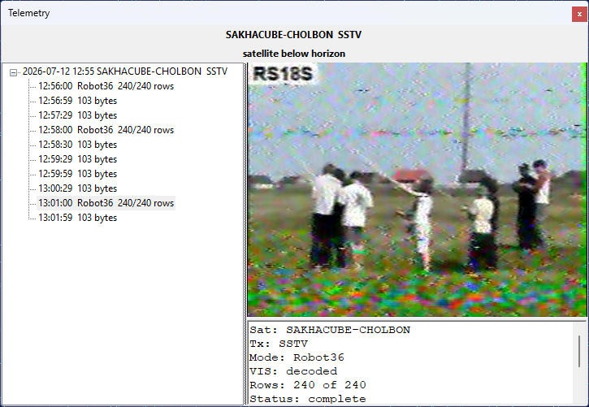
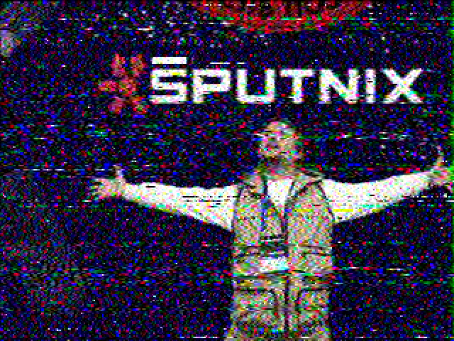
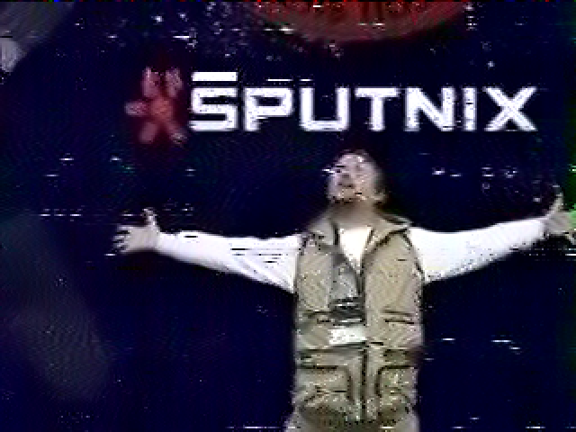
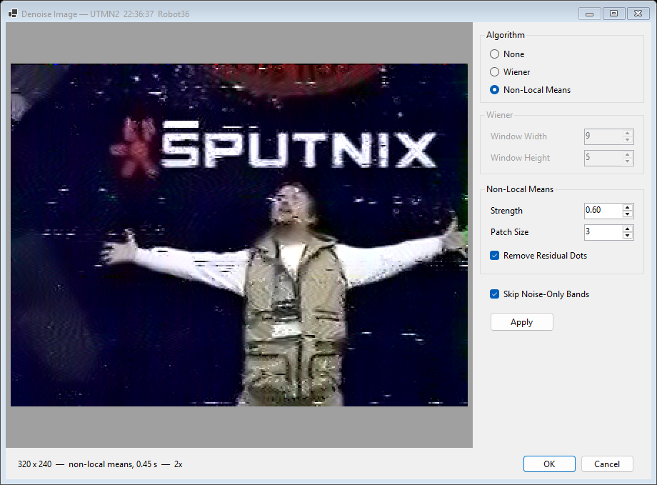

# Receive SSTV Images

Some satellites transmit **SSTV** (Slow-Scan Television) images over an FM downlink. SkyRoof
decodes these images with its built-in decoder, right inside the program — there is no need for an
external SSTV program, a Virtual Audio Cable, or an output stream. The decoded image is built up
line by line in the [Telemetry](telemetry_panel.md) panel as the satellite passes overhead.

## Supported Modes

The decoder supports the YCrCb mode family used by satellites:

- **Robot 36** and **Robot 72**;
- **PD 50**, **PD 90**, **PD 120**, **PD 160**, **PD 180**, **PD 240**, and **PD 290**.

The mode is detected automatically from the **VIS** header and the sync cadence of the received
signal, so you do not have to select it by hand. The RGB Martin and Scottie modes, which are rarely
used by satellites, are currently not supported.

## Decoding an Image

1. Open the [Telemetry](telemetry_panel.md) panel from the **View / Telemetry** menu.

2. Select the satellite in the [Satellite Selector](satellite_selector.md) on the toolbar. If it is
   not in the current group, add it using the [Satellites and Groups](satellites_and_groups_window.md)
   dialog.

3. Select the satellite's **SSTV transmitter**. You can select it in the
   [Satellite Transmitters](satellite_transmitters_panel.md) panel, or by clicking on its label on the
   [frequency scale](frequency_scale.md). The decoder follows the transmitter selection, so make sure
   the SSTV transmitter is the one highlighted in the
   [Satellite Transmitters](satellite_transmitters_panel.md) panel.

4. Make sure the SDR is running and tuned to the satellite. The decoder uses the same
   Doppler-corrected passband as the receiver, so the satellite's signal must be visible on the
   [waterfall](waterfall_display.md) at the tuned frequency.

When the satellite is above the horizon and its signal starts to appear, the decoder detects the SSTV
transmission and begins building the image. Each image appears as a node in the tree, under the pass
node, and updates in place as new scan lines arrive. Select an image node to watch it build up in the
detail pane on the right, together with a **META** section that shows the satellite, transmitter,
mode, whether the VIS header was decoded, the number of rows received, and the decoding status.

There is nothing to start or stop manually: the decoder rides through short signal fades and finalizes
each image when it is complete or the signal is lost. A satellite whose transmitter alternates between
telemetry and SSTV (such as UmKA-1) is handled automatically — the telemetry frames and the SSTV
images both appear in the same panel.

## Denoising an Image

A satellite SSTV picture arrives over an FM link, and once the signal drops toward the FM threshold the
picture fills with coloured speckle. SkyRoof applies a mild **Wiener** filter to every decoded image
automatically, which is what you see while the image is building. When a pass was marginal you can do
considerably better afterwards: right-click a finished image and choose **Denoise Image...**.

| As received | After non-local means |
|---|---|
|  |  |

The command becomes available once an image is complete, because the filter works on the raw
reconstruction that is stored with the finished image.

The dialog shows the picture at double size — the speckle it removes is one to three pixels across and
is hard to judge at 1:1. Roll the **mouse wheel** over the picture to zoom, from 1:1 up to the point
where it fills the pane; enlarging or maximizing the window raises that limit, so maximizing gives you
a close look at fine detail.

Choose the algorithm:

- **None** — the raw reconstruction, with no filtering at all. Note that this is *not* the image you
  started with: the automatic Wiener filter is switched off too, so this is the noisiest of the three.
- **Wiener** — the same filter the decoder applies automatically. Cheap, and gentle on smooth areas,
  but it judges each pixel from its immediate neighbourhood alone, so it thins fine detail such as
  text and thin lines.
- **Non-local means** — much slower, but far better on a noisy pass. Instead of averaging a pixel with
  its neighbours, it searches the surrounding area for patches that look like the one being cleaned
  and averages those. Repeated fine structure — lettering, edges, texture — therefore reinforces
  itself instead of being smoothed away. This is the one to reach for.

Only the settings of the selected algorithm are enabled. For non-local means:

- **Strength** — how much noise the filter assumes is present. Higher removes more speckle but starts
  to flatten real detail; 0.40 to 0.80 suits most pictures, and 1.60 and above is usually too much.
  The best value depends on the pass, which is why the filter is manual rather than automatic.
- **Patch Size** — the size of the patches compared against one another. 3 is a good default.
- **Remove Residual Dots** — a second pass that clears isolated specks the first pass leaves behind.
  An isolated speck resembles nothing else in the picture, so nothing matches it and the plain filter
  preserves it faithfully.

For the Wiener filter, **Window Width** and **Window Height** set the size of the neighbourhood it
averages over. A larger window removes more noise and loses more detail.

**Skip Noise-Only Bands** applies to both algorithms and is on by default. Where the signal dropped
below the FM threshold the picture carries bands of pure noise with no image in them at all. Averaging
those bands turns them into a soft grey wash that reads as a blurred picture rather than as absent
signal, so by default they are left exactly as received and the filtering is concentrated where there
is a picture to improve. Turn this off for a very weak pass in which you can see there is a faint
picture buried in the noise — the program cannot always tell the two cases apart, but you can.

Press **Apply** to filter the picture, and try as many settings as you like: every Apply starts again
from the original, so filters never pile up on one another and **None** always brings back exactly
what was received. **OK** keeps what is on screen and replaces the automatically saved PNG file;
**Cancel** leaves the image as it was.

## Saved Images

Each finalized image is saved automatically as a PNG file, with a JSON sidecar holding its metadata,
in the **SstvImages** subfolder of the [data folder](data_folder.md). You can also right-click an
image in the detail pane and choose:

- **Save As...** — save the image to a location of your choice. This writes the image as it is
  currently shown, so a denoised picture is saved denoised;
- **Copy** — copy the image to the clipboard;
- **Denoise Image...** — clean up a noisy picture, as described above;
- **Open in Viewer** — open the automatically saved PNG file in the program that Windows associates
  with PNG images, where you can see it at full size. This command is available only after the image
  has been finalized and saved, so it stays grayed out while an image is still being received.
