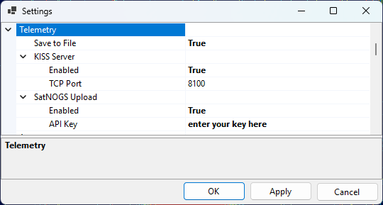

# Setting Up Telemetry Decoding

These settings control the optional outputs of the built-in telemetry decoder used by the
[Telemetry panel](telemetry_panel.md) — saving decoded frames to a file, sharing them over a KISS
server, and uploading them to the SatNOGS database.

## Decoder Settings



The outputs are configured on the **Telemetry** page of the [Settings window](settings_window.md)
(**Tools / Settings**):

- **Save to File** — when enabled, every decoded frame is appended to a daily log file in the
  `TelemetryDecodes` subfolder of the [data folder](data_folder.md). The file contains the same
  information that is shown in the panel: the time, satellite, transmitter, frame length and address,
  the decoded telemetry, and the ASCII, HEX and META views of the frame.

- **KISS Server** — makes the decoded frames available to other telemetry software over a
  KISS-over-TCP server:
  - **Enabled** — turns the server on;
  - **TCP Port** — the TCP port to listen on (8100 by default).

  Point any program that reads KISS frames over TCP — for example a satellite telemetry decoder or a
  custom logging script — at `localhost` and this port to receive the frames as SkyRoof decodes them.

- **SatNOGS Upload** — forwards each decoded frame to the [SatNOGS DB](https://db.satnogs.org/),
  contributing your telemetry to the community database:
  - **Enabled** — turns uploading on;
  - **API Key** — your personal SatNOGS DB API key (see below).

## Uploading to SatNOGS

The [SatNOGS DB](https://db.satnogs.org/) is a community database of satellite telemetry. To
contribute the frames that SkyRoof decodes:

1. **Create an account.** Go to [db.satnogs.org](https://db.satnogs.org/), click **Login**, and
   register (the SatNOGS network uses a single account across all of its sites). Confirm your e-mail
   address and log in.

2. **Copy your API key.** Open your account page (your callsign or name in the top-right corner) and
   go to **Settings**. Your **API Key** is shown there as a long string of letters and digits. Copy it.

3. **Configure SkyRoof.** In **Tools / Settings**:
   - on the **User** page, fill in your **Callsign** and your Maidenhead **Grid Square** — both are
     required, because each uploaded frame is tagged with the observer's call and location;
   - on the **Telemetry** page, expand **SatNOGS Upload**, set **Enabled** to true, and paste the
     API key into the **API Key** field.

4. **Decode some frames.** Open the [Telemetry panel](telemetry_panel.md) and decode a pass of a
   supported satellite. Each frame that passes its integrity (CRC) check is uploaded automatically;
   frames that fail the check are not sent.

5. **Verify on the server.** Confirm that your frames arrived, either way:

   - **Web:** open the satellite's page on [db.satnogs.org](https://db.satnogs.org/) 
     (for example, by clicking on the **SatNOGS** link in the [Satellite Details panel](satellite_details_panel.md)),
     click on **Data** and see if you are listed under **Most Recent Observers**.

   - **API:** query the telemetry endpoint for that satellite and look for your callsign in the
     `source` field of the most recent frames, for example:

     ```bash
     curl -H "Authorization: Token YOUR_API_KEY" "https://db.satnogs.org/api/telemetry/?satellite=NORAD_ID"
     ```

     Replace `YOUR_API_KEY` with your key and `NORAD_ID` with the satellite's NORAD catalog number.

## See Also

- [Telemetry Panel](telemetry_panel.md)
