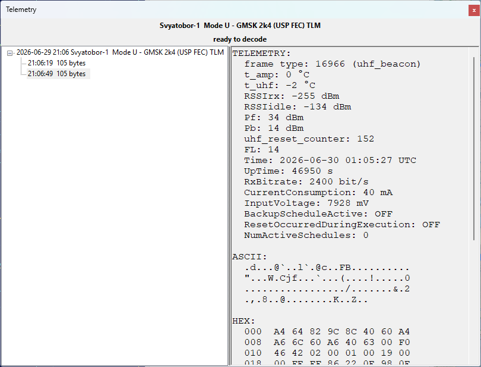

# Telemetry Panel

The Telemetry panel shows the telemetry frames that SkyRoof decodes from the satellite signal.
SkyRoof can decode the telemetry transmitted by many satellites without any external software: the
built-in decoder demodulates and deframes the signal directly from the SDR, right inside the program.
Unlike the [external decoder](decode_telemetry.md) and [sound modem](fsk_afsk_telemetry.md) workflows,
it needs no separate program, no Virtual Audio Cable, and no output stream — SkyRoof feeds the
Doppler-corrected receiver passband straight to the decoder.

The panel is opened from the **View / Telemetry** menu. Its optional outputs — saving to a file,
sharing over a KISS server, and uploading to SatNOGS — are configured as described in
[Setting Up Telemetry Decoding](setting_up_telemetry_decoding.md).

## Supported Signals

The decoder supports the **FSK**, **GFSK**, **GMSK**, and **BPSK** modulations with the framing
formats used by the supported satellites. The modulation, baud rate, and framing are looked up
automatically from the transmitter description in the satellite database, so there is nothing to
configure for the signal itself — you only have to select the right transmitter.

If the selected transmitter uses an unsupported modulation, or its parameters are unknown, the panel
reports `format not supported`, and no decoding takes place.

## Decoding a Pass

1. Open the Telemetry panel from the **View / Telemetry** menu.

2. Select the satellite in the [Satellite Selector](satellite_selector.md) on the toolbar.

3. Select a data transmitter for that satellite. The decoder follows the transmitter selection, so
   pick the transmitter whose telemetry you want to decode. The panel header shows the satellite name
   and the selected transmitter; hover over it to see the resolved signal parameters.

4. Make sure the SDR is running and tuned to the satellite. The decoder uses the same
   Doppler-corrected passband as the receiver, so the satellite's signal must be visible on the
   [waterfall](waterfall_display.md) at the tuned frequency.

That is all that is needed to start decoding. When the satellite is above the horizon and a
supported transmitter is selected, frames are decoded automatically and appear in the panel.

## Layout

- The **header** at the top shows the selected satellite and transmitter. Hover over it to see the
  resolved signal parameters (modulation, baud rate, framing).

- The **status line** below the header shows the current state of the decoder:

  - **satellite below horizon** — decoding is paused until the satellite rises;
  - **ready to decode** — the satellite is up and the decoder is listening;
  - **decoding...** — a burst is being processed;
  - **format not supported** — the transmitter's modulation or framing is not supported;
  - **not decoded** — a terrestrial link is selected, which the decoder does not handle.

- The **tree** on the left lists the decoded passes and frames.

- The **detail pane** on the right shows the contents of the pass or frame selected in the tree.

## Passes and Frames

The frames are grouped by pass. Each top-level node in the tree is one pass of one transmitter,
labeled with the start time, satellite name, and transmitter description. A pass node is created as
soon as the first burst is detected and stays grayed out until the first valid frame is decoded.

Each child node is a single decoded frame, labeled with the time of arrival, the frame length in
bytes, and, for AX.25 frames, the source and destination addresses. The newest pass is expanded
automatically, and the view scrolls to follow new frames as long as the latest frame is selected.

Select a **pass** node to see a summary in the detail pane: the start time, satellite, transmitter,
orbit number, the number of bursts and frames decoded, and the signal parameters.

Select a **frame** node to see its full contents:

- **TELEMETRY** — the named telemetry values decoded from the frame (battery voltage, temperatures,
  and so on), shown only for satellites that SkyRoof has a telemetry definition for;
- **ASCII** — the frame bytes rendered as text;
- **HEX** — a hex dump of the frame bytes;
- **META** — the carrier frequency offset (CFO), signal-to-noise ratio (SNR), CRC check result, and
  the number of corrected bits and erased bytes from forward error correction.

## Sharing the Frames

As each frame is decoded it is also, depending on the
[decoder settings](setting_up_telemetry_decoding.md#decoder-settings):

- appended to a log file in the `TelemetryDecodes` subfolder of the [data folder](data_folder.md);
- sent to any client connected to the KISS-over-TCP server;
- uploaded to the [SatNOGS DB](https://db.satnogs.org/).

## Clearing the List

Right-click anywhere in the tree and choose **Clear All** to remove all passes and frames from the
panel. This clears only the display; frames already saved to file or uploaded are not affected.
